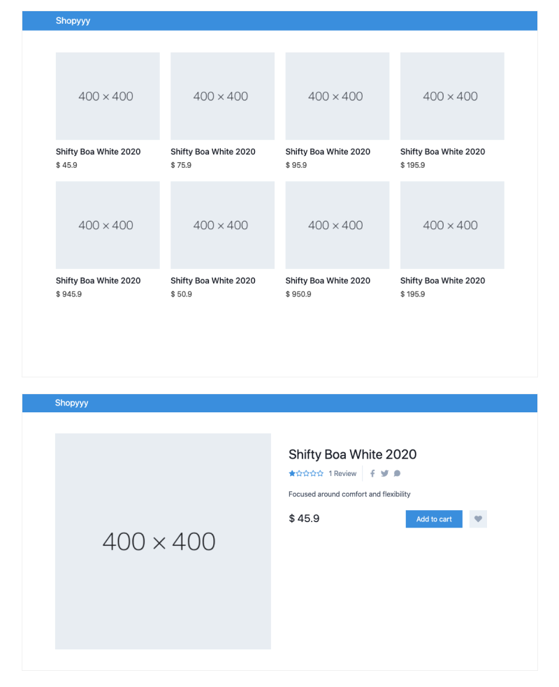

# Vue Shopping Cart



## Technologies

- Deno.js
- Vue.js

## Database

- [] MongoDB

## Development

- [x] Deno.js server
- [x] Vue.js client

### Gettting Started

For development, you need run command line:

```
$ npm run dev
```

* If you have troubleshoot with CORS from API. Currently, you need install CORS changer

- On Chrome: [Moesif Orign & CORS Changer](https://chrome.google.com/webstore/detail/moesif-orign-cors-changer/digfbfaphojjndkpccljibejjbppifbc)
- On Firefox: [Moesif Origin & CORS Changer](https://addons.mozilla.org/en-US/firefox/addon/moesif-origin-cors-changer1/)
