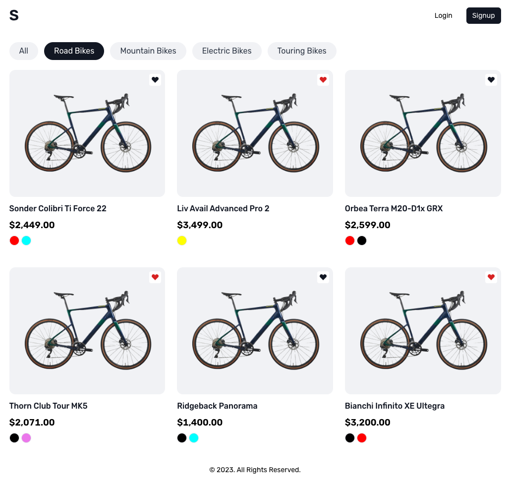

# Vue Shopping Cart



## Technologies

- [Deno.js](https://deno.land/)
- [Vue.js](https://vuejs.org/)
- [AppWrite](https://appwrite.io/)

## Development

- [x] Deno.js server
- [x] Vue.js client
- [x] AppWrite is (BaaS - Backend as a service)

### Gettting Started

Make sure everything is centralized in one place (`deps.ts`)

```shell
$ deno cache server/deps.ts
```

After installation AppWrite, create `.env` in root folder and updated AppWrite environments.

```
APP_WRITE_API_ENDPOINT=http://localhost/v1
APP_WRITE_PROJECT_ID=
APP_WRITE_API_KEY=
```

For development, you need run command line:

```shell
$ npm run dev
```

### About Vue Shopping Cart

> Coming soon for development

Vue shopping cart is a modern web app
- It has a frontend (Vue.js) and a backend (Deno.js)
- It has two roles: customer and manager
- New users have only the customer role
- **Customers** can:
  - [x] Register into the system
  - [x] Login into the system
  - [x] List products
  - [x] See the product details
  - Add the product into the cart
  - Remove the product from the cart
  - Check out the cart
  - List past orders
- **Managers** can:
  - Login into the system
  - Add new products and categories
  - Change the product stocks
  - List products orders
  - See order details
  - Change order status
  - List customers
  - See customers details 

